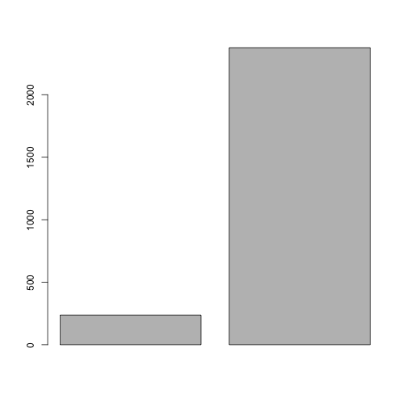

Tutorial 6 Graphics in Base and output
======================================

In this tutorial we will make some exploratory plots for the Chytridomycosis data set that we used in previous tutorials.

We will first load the data set of Chytridomycosis in Australia. We will also use one data set that has the total healthy and infected individuals per year:


```r
class.data <- read.table("Chytridomycosis_short.csv", head = T, sep = ",")
```


The next is the data for the total individuals sampled and infected per year in the study.


```r
totals.data <- read.table("totals_year.csv", head = T, sep = ",")
```


Inspect the data frame totals.data
 

```r
head(totals.data)
```

```
##   years healthy infected
## 1  1997     201        8
## 2  1998     300       25
## 3  1999     633       56
## 4  2000     541       55
## 5  1976       3        0
## 6  1993      11        3
```


The plot() function
-------------------

We can make a scatter plot of the year vs the infected individuals


```r
plot(totals.data$years, totals.data$infected)
```

 


This is the most basic function for plotting in R. However, it is very flexible. A useful parameter is *type*. 


```r
# For histogram-like
plot(totals.data$years, totals.data$infected, type = "h")
```

 

```r

# For lines
plot(totals.data$years, totals.data$infected, type = "l")
```

 

```r

# For points and lines
plot(totals.data$years, totals.data$infected, type = "b")
```

 

```r

# For 'steps'
plot(totals.data$years, totals.data$infected, type = "s")
```

 


Note that the lines look disorganised. This is because R plots objects in data frames as they are ordered in the rows.

**Class exercise: Create a new data frame where totals.data is sorted by year and run the plots above**

Histograms, boxplots, barplots, and piecharts
---------------------------------------------

For some diagnostic plots we can use a different set of functions. These are part of base, like plot(), so their syntax will be similar.

We can obtain a histogram of the years when the data were obtained:


```r
hist(class.data$Year)
```

 


We can get a boxplot to show the differences in healthy and infected individuals


```r
boxplot(totals.data$infected, totals.data$healthy)
```

 


This information could be represented in a bar plot with the barplot() function. Note that this function requires a vector of numbers, which correspond to the height of the bars:
 

```r
barplot(c(sum(totals.data$infected), sum(totals.data$healthy)))
```

 


```r
pie(c(sum(totals.data$infected), sum(totals.data$healthy)))
```

 


**Class exercise: Use the arguments col (for colour), and pch (for point character) to modify the graphics shown here. Try these arguments with numeric and factor values**


Exporting graphics and graphics devices
---------------------------------------

There is much more that we can do with graphics. But before we go any further, we will outline how graphics can be exported from R.

The drop down meny under *File* -> *save* can be used to save the current graphics device in pdf format. However, there are many other options available by using a few commands. For instance, note that the size of the graphics device can be changed, and this changes the aspect ratio of the plot. 

For this part of the tutorial we will load the data file called "survey_data.csv" and inspect its contents.


```r
survey.data <- read.table("survey_data.csv", head = T, sep = ",")
str(survey.data)
```

```
## 'data.frame':	23 obs. of  5 variables:
##  $ Research.topic : Factor w/ 7 levels "Behavior","Conservation",..: 3 1 3 4 3 7 4 2 1 2 ...
##  $ Software.usage : Factor w/ 6 levels "Excel","Matlab",..: 1 4 1 1 1 1 2 1 4 3 ...
##  $ OS             : Factor w/ 3 levels "Linux","Mac OSX",..: 2 3 3 3 3 2 3 2 3 1 ...
##  $ Prog.experience: int  3 4 1 2 1 1 2 3 2 2 ...
##  $ R.experience   : Factor w/ 2 levels "No","Yes": 1 1 1 2 1 1 2 1 2 1 ...
```

```r
head(survey.data)
```

```
##         Research.topic Software.usage       OS Prog.experience
## 1              Ecology          Excel  Mac OSX               3
## 2             Behavior            SAS Windows                4
## 3              Ecology          Excel Windows                1
## 4 Evolutionary biology          Excel Windows                2
## 5              Ecology          Excel Windows                1
## 6                Other          Excel  Mac OSX               1
##   R.experience
## 1           No
## 2           No
## 3           No
## 4          Yes
## 5           No
## 6           No
```


These data are the response from the survey you answered to RSVP for this workshop.

Make a barplot of the Research.area variable. Remember that the barplot() functions uses a numeric vector as its argument. In our case we want the sum of each research area, which we can extract with the summary function for categorical variables:


```r
research.totals <- summary(survey.data$Research.topic)
research.totals
```

```
##             Behavior         Conservation              Ecology 
##                    2                    3                    9 
## Evolutionary biology             Genetics    Molecular biology 
##                    6                    1                    1 
##                Other 
##                    1
```

Note that this produced a vector with the totals. This vectors has names that correspond to each of the categorical values:

```r
names(research.totals)
```

```
## [1] "Behavior"             "Conservation"         "Ecology"             
## [4] "Evolutionary biology" "Genetics"             "Molecular biology"   
## [7] "Other"
```

These data are ready for the barplot.

```r
barplot(research.totals)
```

 

Depending on the size of the graphics device, the labels may disappear. Try this by resizing the device window. Choose a size that you find appropriate and use the following command to export the plot "as is". 
```
dev.copy2pdf(file = "myfirstplot.pdf")
```
Check the help file for dev.copy2pdf() for other formats.

The graphics device can be directed to a pdf file, where the plots are saved. We will open the device to a pdf file and create three plots:

To open a graphics device use:
```
pdf(file = "tutorial6_plots.pdf")
```

The first will be a barplot of the operating systems.

```r
barplot(summary(survey.data$OS))
```

 

The second will be a histogram of the programming experience.

```r
hist(survey.data$Prog.experience)
```

 

The third will be a piechart of whether participants have used R before.

```r
pie(summary(survey.data$R.experience))
```

 


If you look at the file "tutorial6_plots.pdf" you will find that it is empty or it cannot be opened. This is because we have not closed the device, so plots have not been saved. To close the active device use:
```
dev.off()
```
Now look at the "tutorial6_plots.pdf" file. Each plot is saved in a page.


Interactive 3D graphics (optional)
----------------------------------

R has many capabilities for interactive graphics and 3D plots. This requires some additional packages. 
Download and install the rgl package as follows:
```
# To download from CRAN
install.packages("rgl")
```
Packages need to be loaded to make the functions available in R:
```
library(rgl)
```
Load the data set *stat_modelling.csv*:

```r
stat.modelling <- read.table("stat_modelling.csv", head = T, sep = ",")
```


As always, we inspect the data:

```r
str(stat.modelling)
```

```
## 'data.frame':	100 obs. of  4 variables:
##  $ x: num  24.83 20.67 5.19 16.32 16.01 ...
##  $ y: num  85.1 116.9 11 88.3 32.5 ...
##  $ z: num  1.04 1.95 10.18 13.22 17.36 ...
##  $ q: Factor w/ 2 levels "A","B": 1 2 1 1 1 2 1 2 1 2 ...
```


```r
head(stat.modelling)
```

```
##        x      y      z q
## 1 24.834  85.14  1.038 A
## 2 20.666 116.91  1.952 B
## 3  5.186  11.01 10.178 A
## 4 16.324  88.34 13.223 A
## 5 16.012  32.52 17.363 A
## 6 48.031 110.34  9.960 B
```


To obtain a 3D plot use the function plot3d and specify three variables

```
plot3d(stat.modelling$x, stat.modelling$y, col = stat.modelling$z, col = stat.modelling$q, type = "s")
```

You can move the plot with the mouse. 

Take a look at the help file for plot3d for details on the arguments.

Interactive graphics use a different device in R, so the functions to export them as images are different. To get a screenshot and export it as a png file use the following command:

```
snapshot3d(file = "my3dplot.png")
```
