Tutorial 7 Custom graphics
==========================

R graphics are very flexible, but it is necessary to modify the default parameters to customise graphics. In this tutorial we will plot several data sets and include trend lines, legends, and titles. 

Load the data set named "stat_modelling.csv" and save it to a variable called stat.modelling:


```r
stat.modelling <- read.table("stat_modelling.csv", head = T, sep = ",")
```

Use the str() and head() functions to ensure that the data was read correctly.

This data set has four variables. *x*, *y* and *z* are continuous, and *q* is categorical and it is coded as a factor in the data frame.

We can begin with a scatter plot of *x* vs. *y* with a main title and labels for the y and x axes, which should be specified with a string of text. As shown in the previous tutorial, the *pch* parameter can be used to specify the type of points:


```r
plot(stat.modelling$x, stat.modelling$y, main = "Statistical modelling data set", 
    xlab = "Variable x", ylab = "Variable y", pch = 20)
```

 


**Individual exercise: use the *cex* parameter to change the size of the points in the plot above**

In tutorial 6 we used the *col* parameter to change the colour of the points. This parameter can receive a string, an integer, or a factor. Run the code bellow to test the different arguments for *col*:

```
plot(stat.modelling$x, stat.modelling$y, main = "Statistical modelling data set", xlab = "Variable x", ylab = "Variable y", pch = 20, col = 2)

plot(stat.modelling$x, stat.modelling$y, main = "Statistical modelling data set", xlab = "Variable x", ylab = "Variable y", pch = 20, col = "red")
````

To see all the colours available in Base type colours() in the prompt. This is a function that returns the available colours as strings that can be specified to the *col* parameter.

We can specify factors and numeric values to some of the graphical parameters, such as *pch* and *col*. This is useful if our data are associated with some categorical variable. In the stat.modelling data set variable *q* can be used for this purpose as follows:


```r
plot(stat.modelling$x, stat.modelling$y, main = "Statistical modelling data set", 
    xlab = "Variable x", ylab = "Variable y", pch = 20, col = stat.modelling$q)
```

 


To change the type of points we need to specify variable *q* as numeric using the as.numeric() function.

```r
plot(stat.modelling$x, stat.modelling$y, main = "Statistical modelling data set", 
    xlab = "Variable x", ylab = "Variable y", pch = as.numeric(stat.modelling$q))
```

 


Some additions to graphics can be made on the active plot. This is useful to include trend lines, additional points, and legends. We will look at each of these separately. 

Lines
-----

There are two important functions to add lines, lines(), and abline(). lines() takes a set of coordinates as an argument, similar to plot().

In the following example we will give the function two coordinate points along *x* and *y* so the line will be drawn to join the two points. 


```r
plot(stat.modelling$x, stat.modelling$y, main = "Statistical modelling data set", 
    xlab = "Variable x", ylab = "Variable y", pch = as.numeric(stat.modelling$q))

lines(x = c(20, 40), y = c(50, 150))
```

 


(To change the type of line use the parameter *lty*) 

Note that if the function lines() is called again with different point coordinates, it will draw another line on the same plot.


```r
plot(stat.modelling$x, stat.modelling$y, main = "Statistical modelling data set", 
    xlab = "Variable x", ylab = "Variable y", pch = as.numeric(stat.modelling$q))

lines(x = c(20, 40), y = c(50, 150))

lines(x = c(40, 20), y = c(50, 150))
```

 

Note that we can specify more than two points to the lines function:

```r
plot(stat.modelling$x, stat.modelling$y, main = "Statistical modelling data set", 
    xlab = "Variable x", ylab = "Variable y", pch = as.numeric(stat.modelling$q))
lines(x = c(20, 30, 50), y = c(50, 150, 100))
```

 


The abline() function is used to draw straight lines, which is useful for linear regression. Instead of specifying coordinates, the parameters are *a* and *b*, where *a* is the intercept in the y axis (*y* when *x* = 0), and *b* is the slope of the line.


```r
plot(stat.modelling$x, stat.modelling$y, main = "Statistical modelling data set", 
    xlab = "Variable x", ylab = "Variable y", pch = as.numeric(stat.modelling$q))

abline(a = 0, b = 4)
```

 


Points
------

The function points() is similar to lines() in that it receives *x* and *y* coordinates.


```r
plot(stat.modelling$x, stat.modelling$y, main = "Statistical modelling data set", 
    xlab = "Variable x", ylab = "Variable y", col = stat.modelling$q, pch = 20)

points(x = c(10, 20, 30, 40, 50), y = c(0, 50, 100, 150, 200), pch = 17, cex = 3)
```

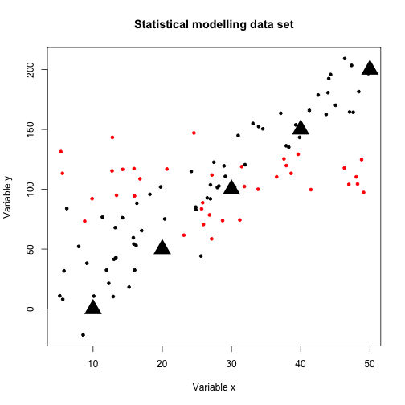 


Legends
-------

In the previous plots it would be useful to include a legend. This is possible with the legend() function. Some of the arguments include the *xy* coordinates for its position in the plot. 

We will first use it to represent the colours:


```r
plot(stat.modelling$x, stat.modelling$y, main = "Statistical modelling data set", 
    xlab = "Variable x", ylab = "Variable y", col = stat.modelling$q, pch = 20)
legend(x = 10, y = 200, legend = c("A", "B"), fill = c("black", "red"))
```

 


Multiple graphics in a single device
------------------------------------

To change most settings of graphics devices we can use the par() function. It should be called before the plot. One way to use it is to specify several plots in a device with the parameter *mfrow*. This argument receives a vector with the number of rows and columns to be plotted. This can be understood by visualising the graphics device as a matrix:

Look at the help file for par() for more details.


```r
par(mfrow = c(3, 1))
plot(stat.modelling$x, stat.modelling$y, main = "Statistical modelling data set", 
    xlab = "Variable x", ylab = "Variable y", col = stat.modelling$q, pch = 20)
hist(stat.modelling$x, main = "Histogram for x", xlab = "Variable x")
hist(stat.modelling$y, main = "Histogram for y", xlab = "Variable y")
```

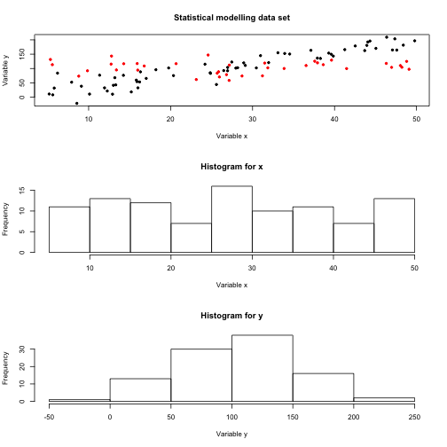 


**Individual exercise: Try different arguments for the *mfrow* parameter in the par() function.**

Images and heatmaps
-------------------

With matrices we can plot the data as a heat map, which includes a hierarchical clustering dendrogram of the variables and observations. In this example we will create a fake data set and plot it with heatmap().


```r
var1 <- 1:5
var2 <- var1 * 4
var3 <- 11:15
matrix.data <- cbind(var1, var2, var3)
heatmap(matrix.data)
```

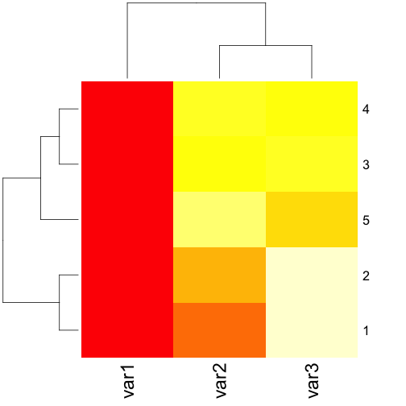 


Plotting maps (optional)
------------------------

R can be used to plot maps. There are many resources available to interact with Geographic Information Systems. One easy way to do this is with the map functions, which require some additional packages.

```
install.packages("maps")
```


```r
library(maps)
map(regions = "australia")
```

 

We can add points to the map. For example, load the Chytridomycosis_short.csv data set and plot the latitude and longitude of the samples collected as follows:


```r
map(regions = "australia")
chytrid.data <- read.table("Chytridomycosis_short.csv", sep = ",", head = T)
points(chytrid.data$Longitude, chytrid.data$Latitude, pch = 20, col = "red")
```

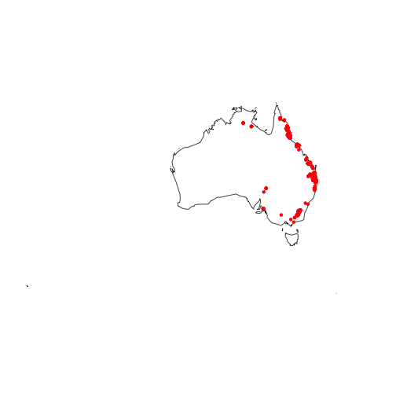 


Exploring ggplot2 graphics(optional)
------------------------------------

ggplot2 is a packages that uses a different syntax for graphics, but it can be useful to display large amounts of information, such as statistical tests. Another advantage is that it includes legends and colours by default, so it is sometimes simpler to use than Base. In this example we will start with a scatterplot of *x* and *y* in the stat.modelling data set, and include more information on the plot progressively.

To install and load this package use the following code:
```
install.packages("ggplot2")
```

```r
library(ggplot2)
```


To plot our data we need to specify an ggplot object with the ggplot() function and then use the + sign specify how the data should be represented. The ggplot() function uses the parameter *data* and the function aes(). *data* should be a data frame, and aes() can use many possible parameters, such as *y*, and *x* for each axis. The arguments for aes() are the names of the columns in the data frame specified in *data*.

For a basic scatterplot use + geom_point():

```r
ggplot(data = stat.modelling, aes(x = x, y = y)) + geom_point()
```

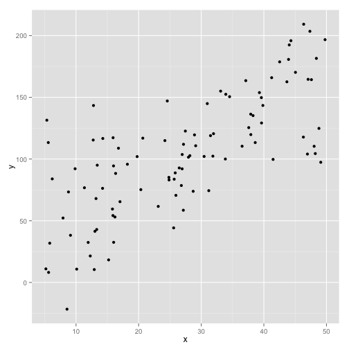 

We can specify the parameter *size* so that the points have sizes according to variable *z* in the data set.

```r
ggplot(data = stat.modelling, aes(x = x, y = y, size = z)) + geom_point()
```

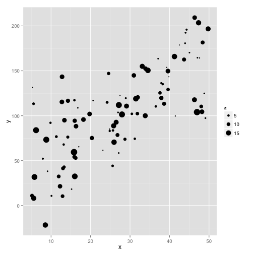 

Similar to *size*, we can specify that the colours should correspond to the variable *q* with the parameter *colour* 

```r
ggplot(data = stat.modelling, aes(x = x, y = y, size = z, colour = q)) + geom_point()
```

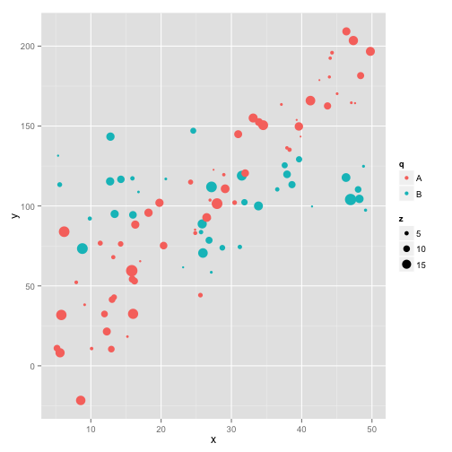 


We can specify additional objects with the + sign. These can be considered to be layers, represented as points and lines. To add a regression line use stat_smooth(), specifying the parameter *method* as lm, which stands for linear model.

```r
ggplot(data = stat.modelling, aes(x = x, y = y)) + geom_point() + stat_smooth(method = lm)
```

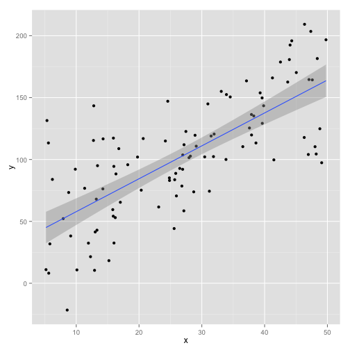 


We can include the colour or size, and this is taken into account in the linear model:

```r
ggplot(data = stat.modelling, aes(x, y, colour = q)) + geom_point() + stat_smooth(method = lm)
```

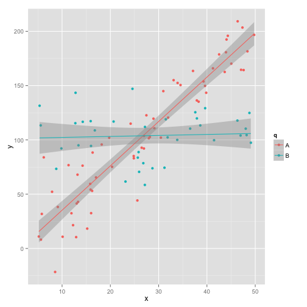 


These also apply for box plots, histograms, and other graphics, for example:

```r
ggplot(data = stat.modelling, aes(q, y)) + geom_boxplot()
```

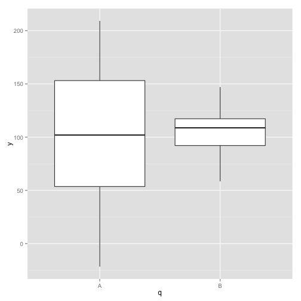 


```r
ggplot(data = stat.modelling, aes(y)) + geom_histogram()
```

```
## stat_bin: binwidth defaulted to range/30. Use 'binwidth = x' to adjust
## this.
```

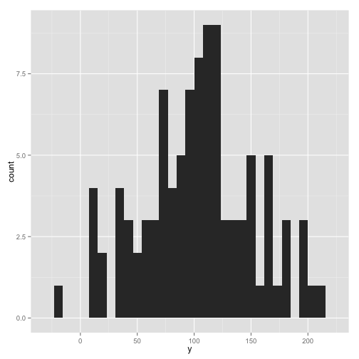 


```r
ggplot(data = stat.modelling, aes(x = y, fill = q)) + geom_bar()
```

```
## stat_bin: binwidth defaulted to range/30. Use 'binwidth = x' to adjust
## this.
```

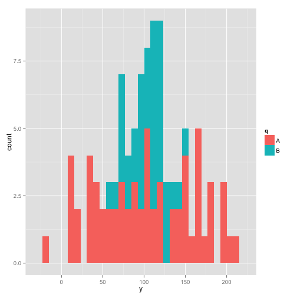 


For more details on using ggplot2 please see this [book](http://www.booktopia.com.au/r-graphics-cookbook-winston-chang/prod9781449316952.html) and this [website](http://docs.ggplot2.org/0.9.2.1/index.html).

