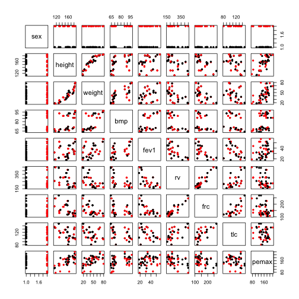
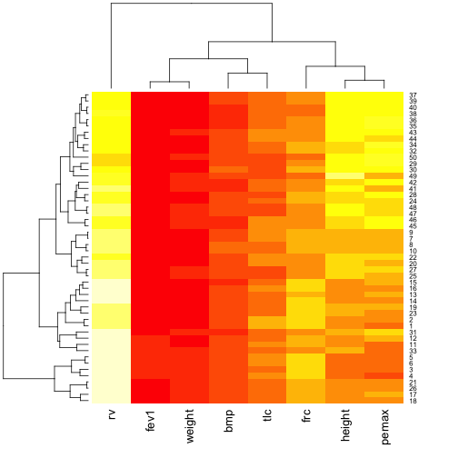

Tutorial 8. Tools for data analysis
===================================


In this tutorial we will analyse a real data set by making use of some of the tools from the previous tutorials.

Our example is some lung capacity data for some patients with cystic fibrosis (the data were obtained from the ISwR package in R). 
Start by loading the data set:


```r
cyst.data <- read.table("cyst_fibr.csv", head = T, sep = ",")
```


Verify that the data were loaded correctly:


```r
str(cyst.data)
```

```
## 'data.frame':	50 obs. of  9 variables:
##  $ sex   : Factor w/ 2 levels "Female","Male": 1 2 1 2 1 1 1 2 2 2 ...
##  $ height: num  113 114 115 117 128 ...
##  $ weight: num  17.9 18.3 18.1 17.4 18.4 19.8 20.6 26.7 19.6 27.4 ...
##  $ bmp   : int  68 68 65 65 64 64 67 93 67 93 ...
##  $ fev1  : int  32 32 19 19 22 22 41 52 41 52 ...
##  $ rv    : int  258 258 449 449 441 441 234 202 234 202 ...
##  $ frc   : int  183 183 245 245 268 268 146 131 146 131 ...
##  $ tlc   : int  137 137 134 134 147 147 124 104 124 104 ...
##  $ pemax : num  107.6 125 110.5 76.5 138.7 ...
```


The variables are defined as follows:

	‘sex’ a numeric vector code, 0: male, 1:female.

	‘height’ a numeric vector, height (cm).

	‘weight’ a numeric vector, weight (kg).

	‘bmp’ a numeric vector, body mass (% of normal).

	‘fev1’ a numeric vector, forced expiratory volume.

	‘rv’ a numeric vector, residual volume.

	‘frc’ a numeric vector, functional residual capacity.

	‘tlc’ a numeric vector, total lung capacity.

	‘pemax’ a numeric vector, maximum expiratory pressure.

A good first step is to plot all the variables:


```r
plot(cyst.data, pch = 20, col = cyst.data$sex)
```

 


Some variables appear to be correlated. We can inspect their relationship with a heatmap. We need to remove the *sex* variable because it is not numeric and this can cause an error in the heatmap() function. We also need to coerce the data frame to a matrix. 


```r
heatmap(as.matrix(cyst.data[, -1]))
```

 


**Individual exercise: Make a histogram of *pemax* and conduct a shapiro-wilk test of normality** 

There are variables of interest. One possibility is to conduct a large linear regression with all the variables in the data set. For the purpose of this workshop, we will aim to explain whether the maximum expiratory pressure (variable *pmax*) is associated with the weight of the individual (variable *weight*), and whether this depends on the gender (variable *sex*).
 
**Individual exercise: Use a box plot to determine whether there is a significant difference in *pemax* among genders with the appropriate test. 
Tip: In the anova() funcion you can use a formula, but with var.test(), t.test() and others, it is necessary to specify vectors for each level. Use indexing and the == operator to separate the data for Male and Female** 

To test whether there is an significant relationship between *pemax* and *weight* we can define a linear model. We will use a slightly different syntax because we will specify the data set in the *data* parameter.

```r
model.1 <- lm(pemax ~ height * sex, data = cyst.data)
# Recall that A*B represents A + B + A:B, where A:B is the interaction term
```


The regression coefficients can be obtained with the summary() function:


```r
summary(model.1)
```

```
## 
## Call:
## lm(formula = pemax ~ height * sex, data = cyst.data)
## 
## Residuals:
##    Min     1Q Median     3Q    Max 
## -74.96  -9.62   2.73  14.54  40.01 
## 
## Coefficients:
##                Estimate Std. Error t value Pr(>|t|)    
## (Intercept)      4.2807    35.8134    0.12     0.91    
## height           0.9984     0.2270    4.40  6.4e-05 ***
## sexMale        -21.4868    49.2355   -0.44     0.66    
## height:sexMale   0.0845     0.3111    0.27     0.79    
## ---
## Signif. codes:  0 '***' 0.001 '**' 0.01 '*' 0.05 '.' 0.1 ' ' 1
## 
## Residual standard error: 23.1 on 46 degrees of freedom
## Multiple R-squared:  0.503,	Adjusted R-squared:  0.471 
## F-statistic: 15.5 on 3 and 46 DF,  p-value: 4.11e-07
```


The *P* values in the table test the null hypothesis that the estimated coefficients are equal to 0, which determines their effect in the dependent variable (pemax).

The *P* value for the estimate of the slope of height is significant, but there appears to be no difference in the gender, or in the slope term between genders. Including *sex* and *sex:height* in the model may not be appropriate to explain these data, and we may prefer a model with *height* as the only explanatory variable. 

To determine which terms should be kept in the model we can use the anova() function with the model as an argument. In this case the *P* values correspond to whether the inclusion of any variables in the model result in significantly better fit:


```r
anova(model.1)
```

```
## Analysis of Variance Table
## 
## Response: pemax
##            Df Sum Sq Mean Sq F value  Pr(>F)    
## height      1  23944   23944   44.92 2.6e-08 ***
## sex         1    843     843    1.58    0.21    
## height:sex  1     39      39    0.07    0.79    
## Residuals  46  24521     533                    
## ---
## Signif. codes:  0 '***' 0.001 '**' 0.01 '*' 0.05 '.' 0.1 ' ' 1
```


An other approach to test competing models is to define the models in separate objects, and testing their fit with ANOVA. We will specify a simpler model in model.2 and compare it with model.1:

```r
model.2 <- lm(pemax ~ height, data = cyst.data)

anova(model.1, model.2)
```

```
## Analysis of Variance Table
## 
## Model 1: pemax ~ height * sex
## Model 2: pemax ~ height
##   Res.Df   RSS Df Sum of Sq    F Pr(>F)
## 1     46 24521                         
## 2     48 25403 -2      -882 0.83   0.44
```


In this case there are not many possible combinations of variables in the model. In linear regression with more variables the number of possible models can be very large, and it is difficult to test which variables should be included. 

R has many implemented tools for model selection. The step() function is particularly useful for this purpose. It takes the most complex model, and removes parameters sequentially. The AIC (Akaike Information Criterion) score is evaluated every time a parameter is removed. The function then returns the simplest model.


```r
model.min <- step(model.1)
```

```
## Start:  AIC=317.8
## pemax ~ height * sex
## 
##              Df Sum of Sq   RSS AIC
## - height:sex  1      39.3 24560 316
## <none>                    24521 318
## 
## Step:  AIC=315.8
## pemax ~ height + sex
## 
##          Df Sum of Sq   RSS AIC
## - sex     1       843 25403 316
## <none>                24560 316
## - height  1     24079 48640 348
## 
## Step:  AIC=315.5
## pemax ~ height
## 
##          Df Sum of Sq   RSS AIC
## <none>                25403 316
## - height  1     23944 49347 347
```


A useful diagnostic is to observe the fitted values. This can be done with the predict() function. As used bellow, the function returns a matrix of *n* x 3, where *n* is the number of observations. The first column is the fitted values, and the second and third are the upper and lower bounds of the 95% confidence interval.


```r
fitted <- predict(model.min, data = cyst.data, interval = "confidence")
head(fitted)
```

```
##     fit    lwr   upr
## 1 111.9  96.89 126.9
## 2 112.3  97.41 127.2
## 3 113.6  99.10 128.2
## 4 116.1 102.17 130.0
## 5 126.9 115.76 138.0
## 6 127.6 116.66 138.6
```

Note that we specified the original data set in the *data* parameter. We can use this function to predict *pemax* for any set of values, in such case the *data* parameter receives a data frame with data for prediction. The column names of the data frame should correspond to those of the original data set.

To visualise the fitted values we can use the lines() function. We will use the *lty* parameter to distinguish the confidence interval lines from the fitted values:


```r
plot(cyst.data$height, cyst.data$pemax, pch = 20, xlab = "Height (cm)", ylab = "Maximum expiratory pressure (PSI)")
lines(cyst.data$height, fitted[, 1])
lines(cyst.data$height, fitted[, 2], lty = 2)
lines(cyst.data$height, fitted[, 3], lty = 2)
```

 


